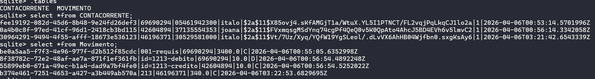
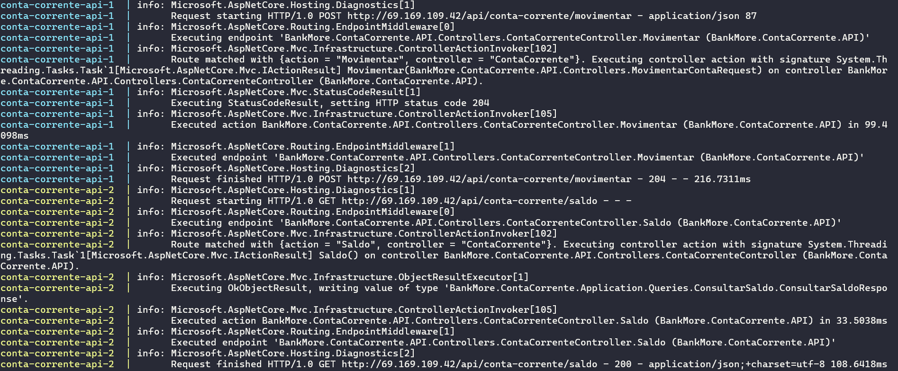
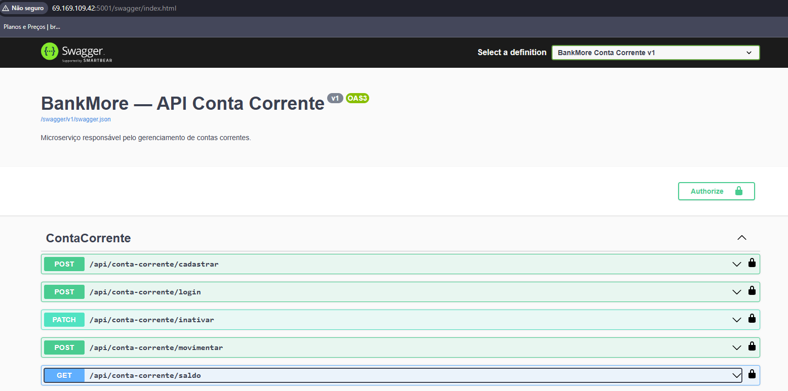
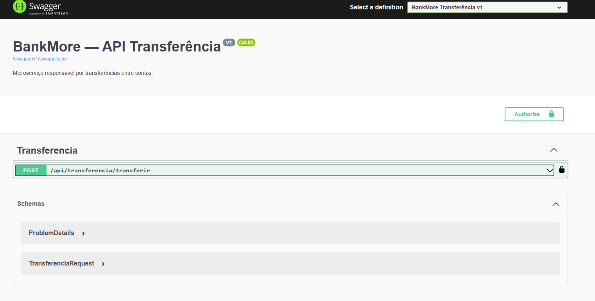

# BankMore — Microserviço: Conta Corrente

## Stack
- **.NET 8** | **Clean Architecture** | **CQRS + MediatR** | **DDD**
- **Dapper** + **SQLite** | **JWT** | **BCrypt** | **Swagger**
- **xUnit** + **NSubstitute** + **FluentAssertions**

---

## Estrutura

```
BankMore/
├── src/
│   ├── BankMore.ContaCorrente.Domain/       # Entidades, Value Objects, Interfaces, Enums
│   ├── BankMore.ContaCorrente.Application/  # Commands, Queries, Handlers (MediatR)
│   ├── BankMore.ContaCorrente.Infrastructure/ # Dapper, JWT, BCrypt, SQLite
│   └── BankMore.ContaCorrente.API/          # Controllers, Swagger, Middleware
└── tests/
    └── BankMore.ContaCorrente.Tests/        # xUnit + NSubstitute (padrão AAA)
```

---

## Executar localmente

```bash
cd src/BankMore.ContaCorrente.API
dotnet run
# Swagger: http://localhost:5000/swagger
```

## Executar via Docker

```bash
docker-compose up --build
# Swagger: http://localhost:5001/swagger
```

## Executar testes

```bash
dotnet test
```

---

## Endpoints

| Método | Rota                          | Auth | Descrição              |
|--------|-------------------------------|------|------------------------|
| POST   | /api/conta-corrente/cadastrar | ❌   | Cadastra nova conta    |
| POST   | /api/conta-corrente/login     | ❌   | Efetua login (JWT)     |
| PATCH  | /api/conta-corrente/inativar  | ✅   | Inativa a conta        |
| POST   | /api/conta-corrente/movimentar| ✅   | Crédito ou débito      |
| GET    | /api/conta-corrente/saldo     | ✅   | Consulta saldo         |

---

## Decisões técnicas

| Ponto              | Decisão                                                  |
|--------------------|----------------------------------------------------------|
| Senha              | Hash com BCrypt (custo padrão 10)                        |
| Token JWT          | Contém apenas `numeroConta` — CPF nunca sai do serviço   |
| Idempotência       | Verificação por `IdRequisicao` único na tabela MOVIMENTO |
| Saldo              | Calculado dinamicamente (SUM créditos - SUM débitos)     |
| Banco de dados     | SQLite em desenvolvimento |
| ORM                | Dapper puro — sem Entity Framework                       |

Banco conta corrente


Instancias duplicadas


Swagger Api conta corrente



Swagger Api Transferencia
